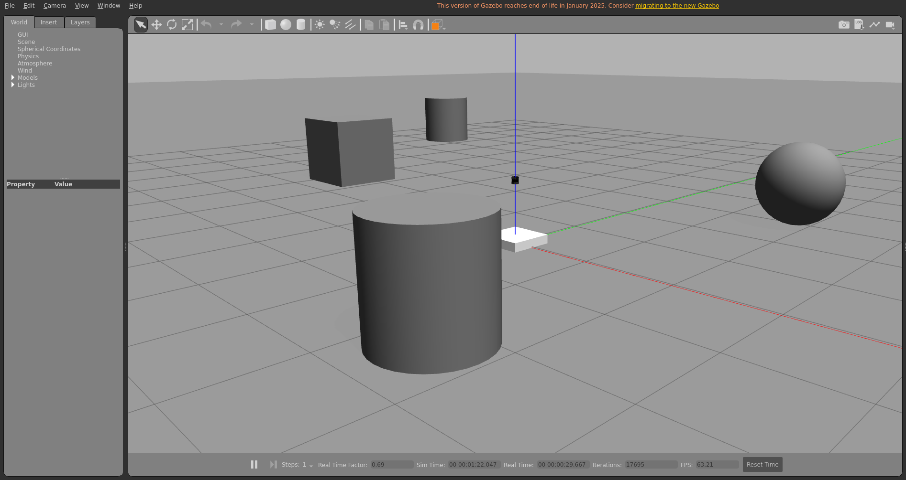
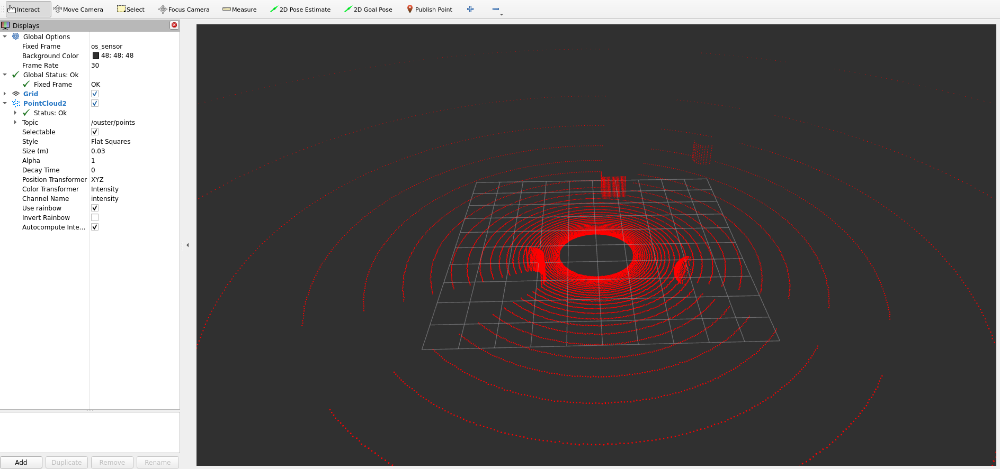
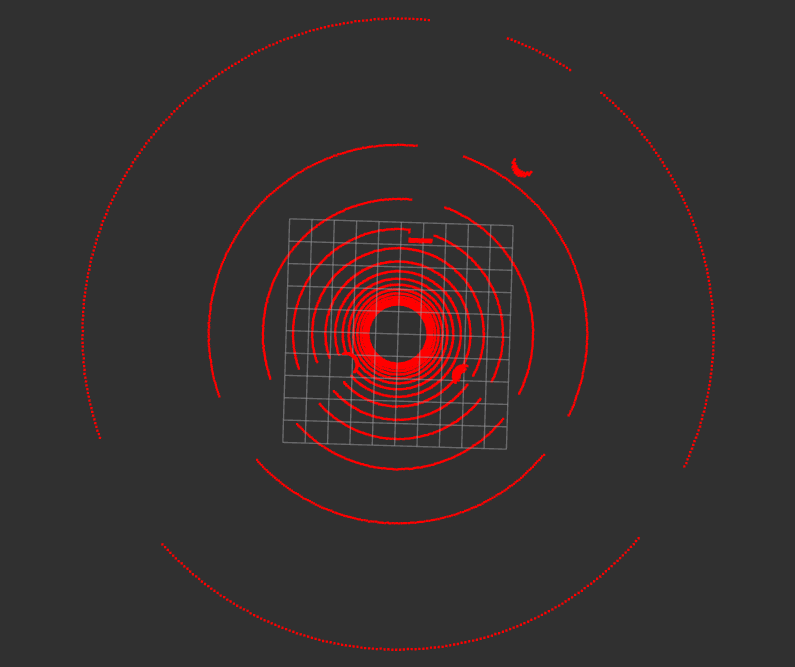
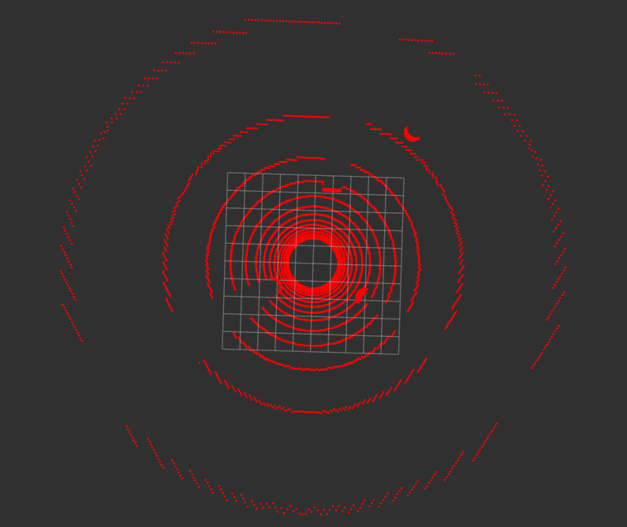

# Ouster Simulation
A Gazebo Classic plugin-based simulation of the Ouster LiDAR sensor.   
This package publishes point cloud data in `sensor_msgs/msg/PointCloud2` format and is designed for use in simulation environments.




## ✅ Supported Environment
- **ROS**: ```Humble```  
- **Gazebo**: ```Classic 11```

# 🛠️ Build
```
cd ~/your_ws/src
git clone https://github.com/sweunwave/ouster_simulation.git
cd ..
colcon build --symlink-install --cmake-args -DCMAKE_BUILD_TYPE=Release --packages-select ouster_simulation
```

# 🚀 Launch Example
```
ros2 launch ouster_description os1_64_alone.launch.py
ros2 launch ouster_description os1_64_alone.launch.py gpu:=true
  
ros2 launch ouster_description os1_32_alone.launch.py
ros2 launch ouster_description os1_32_alone.launch.py gpu:=true
```
## GPU Option
* gpu:=false

  

* gpu:=true



# 📦 Based On
* https://github.com/wilselby/ouster_example.git
* https://github.com/clearpathrobotics/ouster_description.git
* https://bitbucket.org/DataspeedInc/velodyne_simulator/src/master/